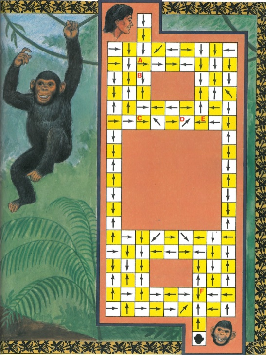

# Tarzan and Jojo Puzzle Solver
Program that can read in and solve Tarzan and Jojo mazes.

The Tarzan and Jojo maze problem, from “MAD MAZES: Intriguing Mind Twisters for Puzzle Buffs, Game Nuts and Other Smart People” by Robert Abbott", 
is based on the puzzle description below:

  > Tarzan was spending a peaceful day in the jungle when his friend Jojo the chimpanzee <br/>
  began taunting him. “You can’t catch me, ape-man,” shouted Jojo. Tarzan, always one <br/>
  to enjoy a good chase, began swinging after him, only to find that Jojo had tangled up <br/>
  all of the hanging tree vines. Therefore, as Tarzan swings through the jungle, he can <br/>
  only move in the direction of the arrow in the square at the beginning of each swing. <br/>
  And because of the length of the vines, each swing must carry him exactly three or four <br/>
  squares. <br/>
  Tarzan begins on the square at the top. From there he can travel three squares to A <br/>
  or go four squares to B. Suppose he goes to square B. On the next turn he can only go <br/>
  three squares (from B it is impossible to travel four squares). From square C he can go <br/>
  three squares to D or four squares to E. <br/>
  Jojo has hidden in the square at the bottom of the maze of vines. How can Tarzan get <br/>
  to that square? (Note that only one square, the one marked F, will enable Tarzan to <br/>
  swing onto Jojo’s square.

### Picture of the diagram:



### CHANGE INPUT FILE NAME: <br/>
If necessary, in the main function, you can change the ``` INFILE(“input.txt”) ``` to the desired input file name.

### CHANGE MAKEFILE BOOST ENVIRONMENT:  <br/>
In the Make file, change the ``` BOOST_HOME ``` to where you installed the boost library. 
I had it installed in my Program Files and the Boost library I used was version 1.70.

### COMPILE:  <br/>
To compile the makefile, I have mingw and used the command ``` mingw32-make ``` in the terminal to compile it. 
You should be able to compile the makefile like normally, by ``` mingw32-make ``` or ``` make ```.

### RUN CODE:  <br/>
After running the makefile and compiling the code, type ``` .\puzzleSolver ``` in the terminal to run the code. 
Once you see "Reading input…” in the terminal, the code will soon write the output to the output file. 

### TRY THE PUZZLE SOLVER: <br/>
In the ``` INFILE("input.txt") ``` part of code, replace ``` input.txt ``` with ``` tarzan.txt ```, ``` small.txt ```, or ``` large.txt ``` to solve the mazes.
You can even make your own maze and test the maze solver.

### EXPLANATION OF INPUT FILES: <br/>
- The first line represents the number of rows and columns.
- The next line represents the location of Tarzan's starting location.
- The other lines represent the directional information for each vine in the maze.
- ``` N ``` = North
- ``` S ``` = South
- ``` E ``` = East
- ``` W ``` = West
- ``` X ``` = Location with no vine
- ``` J ``` = Location of Jojo
